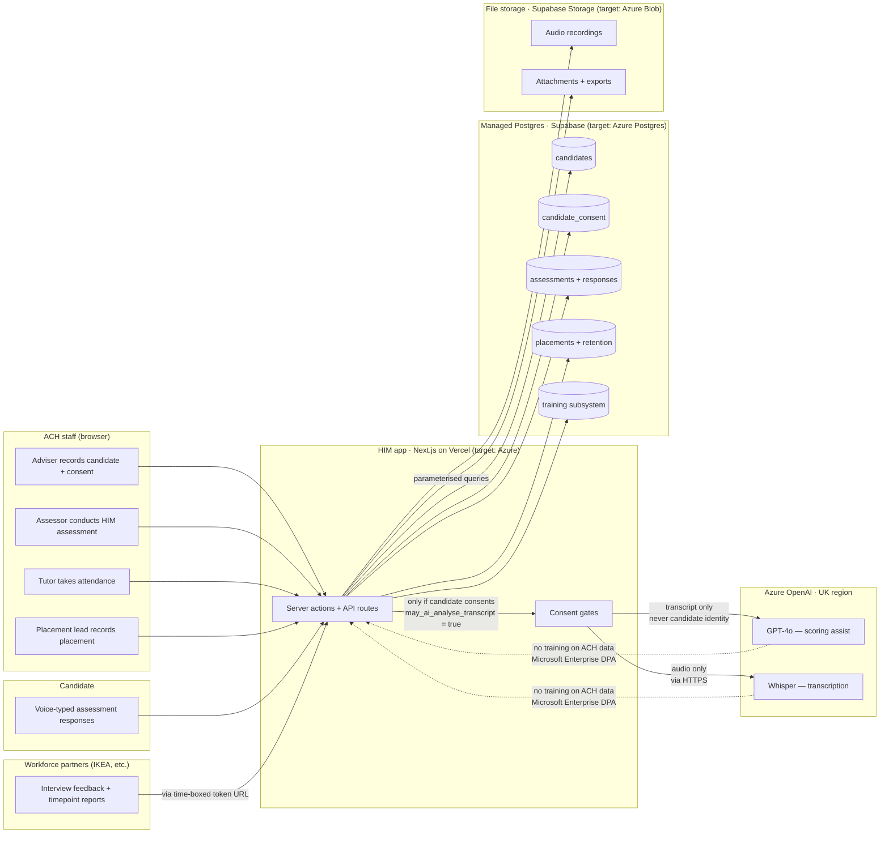

# HIM Platform · Compliance Pack (Phase 8)

**Purpose:** Everything a DPO, funder, or Charity-Commission-adjacent auditor asks for when they say *"tell us about your data."*

**Status:** Amber — documents drafted, DPIA signature pending
**Last reviewed:** 2026-07-22

---

## 1 · Data Flow Diagram

**Key data-flow properties:**

- **All flows are HTTPS.** No plaintext transport.
- **Personal data never leaves the EU/UK.** Supabase (AWS UK), Vercel (EU regions), Azure OpenAI (UK South). Migration target: fully Azure UK South.
- **Azure OpenAI is consent-gated.** Transcripts are only sent to the model if the candidate has explicitly consented (`candidate_consent.may_ai_analyse_transcript = true`). No consent → no AI call, and a suggestion row is written with `status='skipped_no_consent'` for audit.
- **Partner portal writes go through a time-boxed token,** not a login. Tokens are revocable and scoped to a single partner's placements.
- **No outbound reporting to third parties.** All funder / board reports are generated as PDF/Word downloads by ACH staff; nothing is pushed out.

---

## 2 · Data classification

| Data category | Sensitivity | Basis for processing | Retention |
|---|---|---|---|
| Candidate identity (name, DOB, contact) | Personal | Legitimate interest (delivery of grant-funded employment programme) | 7 years post-programme exit |
| Candidate demographics (country of origin, ESOL, refugee status) | Special category (Article 9) | Explicit consent + provision of services (Sch 1 DPA 2018 para 6) | 7 years post-programme exit |
| HIM assessment responses (scores + narrative) | Personal + special category | Explicit consent | 7 years post-programme exit |
| Voice recordings | Special category | Explicit consent (separately toggled) | 90 days post-transcription; audio deleted, transcript retained |
| Consent records | Personal | Legal obligation (GDPR Article 7 — proof of consent) | Full lifecycle + 10 years |
| Placement / employment outcomes | Personal | Legitimate interest + funder reporting obligations | 7 years post-programme exit |
| Training attendance + notes | Personal | Legitimate interest | 7 years post-programme exit |
| AI scoring rationale + evidence quotes | Personal | Explicit consent (inherits parent assessment) | Aligned with parent assessment |
| Anonymised aggregate reports | Not personal | N/A | Retained indefinitely for funder audit |

**Special-category safeguards:**

- Country of origin + refugee status are marked as special category and only shown to authorised ACH staff (post-SSO)
- Voice recordings are the highest-sensitivity item; delete-after-transcription policy is documented and enforced at the app layer
- AI transcript analysis is *separately* consented — it's not implied by the standard consent

---

## 3 · Legal basis and lawful bases

Primary lawful bases under UK GDPR:

- **Article 6(1)(a) consent** — for AI transcript analysis, publication of candidate stories, voice recordings
- **Article 6(1)(b) contract / pre-contract** — for delivering the programme the candidate signed up for
- **Article 6(1)(f) legitimate interest** — for internal programme evaluation, cohort analytics, safeguarding
- **Article 9(2)(a) explicit consent** — for all special-category processing (refugee status, health/wellbeing narrative, cultural background)

**Legitimate-interest assessment (LIA)** and **data protection impact assessment (DPIA)** — templates exist but **need ACH DPO sign-off before HIM handles a new cohort or takes on new partner data.**

---

## 4 · Data subject rights

HIM must support all UK GDPR rights. Current status:

| Right | Support | Notes |
|---|---|---|
| Right of access | Manual export from HIM by ACH staff | Post-SSO, add a "download my record" API |
| Right to rectification | ACH staff can edit any candidate record | Audit log needed for who changed what |
| Right to erasure | Manual delete from HIM | Requires "delete cascade" verification across 20+ tables — automate |
| Right to restriction | Manual — mark candidate as restricted | Add `processing_restricted_at` field |
| Right to portability | JSON export (schema documented) | Build API endpoint |
| Right to object | Consent withdrawal cascades to processing | Verify AI scoring flags previous suggestions on withdrawal |
| Rights re automated decision-making (Art 22) | AI is decision-*support*, not decision-*making*. Assessor is the decision-maker. | Documented in HIM Methodology Spec |

**Article 22 posture:** HIM's AI never makes a decision. It suggests. An assessor always makes the final call. This is documented, versioned, and shown to the candidate in the consent flow.

---

## 5 · Subprocessors

The full list of every third party that touches ACH data.

| Subprocessor | Purpose | Data | Location | DPA status |
|---|---|---|---|---|
| Supabase Inc. | Managed Postgres + auth + storage | All ACH data | AWS EU (Ireland) or AWS UK | Standard DPA — needs ACH signature (currently on personal account) |
| Vercel Inc. | Hosting + preview deploys | Request logs, IP, no candidate data at rest | AWS + own regions (EU/US) | Standard DPA — needs ACH signature |
| Microsoft Azure (Azure OpenAI Service) | GPT-4o inference, Whisper transcription | Transcripts only (consent-gated), voice audio | UK South | Microsoft Enterprise DPA — signed under Azure subscription |
| Microsoft (GitHub) | Source code hosting | Code only, no candidate data | US (public regions) | GitHub DPA — no personal data involved |
| Microsoft (Entra ID · target) | SSO identity provider | Staff identity, not candidate data | UK / EU (per ACH tenant) | Covered under M365 EA |
| Azure Blob Storage (target) | File storage post-migration | Audio, attachments | UK South | Azure DPA |
| Sentry (target · optional) | Error tracking | No PII (scrubbed) | EU (Frankfurt) — verify before adoption | Standard DPA |
| Uptime provider (target · optional) | Availability monitoring | No PII | EU | Standard DPA |
| Vercel Cron / Azure Scheduler | Timed jobs (at-risk recompute) | No PII | Same as host | Same as host |

---

## 6 · Model / LLM provider terms — the questions that matter

For **Azure OpenAI Service** (current + target):

- **Does Microsoft train on your data?** ❌ No. Azure OpenAI Service data is **not used to train** Microsoft's base models. This is contractual under the Azure Product Terms. Confirmed in writing.
- **Where is data processed?** UK South region (Azure region we pin to)
- **How long is prompt/response data retained?** 30 days by default for abuse monitoring. **Zero-retention option available on request** for enterprise customers — recommend enabling for ACH post-migration
- **Is inference logged?** By ACH: yes (via `ai_score_suggestions` table). By Microsoft: metadata only, no content beyond the 30-day abuse window
- **Human review?** Only if flagged for abuse-monitoring investigation, not for training. Opt-out via zero-retention

**For any future model provider,** the same four questions must be answered before switching.

---

## 7 · Incident response one-pager

**Scenario:** Data breach or credible risk of one (e.g. leaked service-role key, unauthorised access detected in logs, SQL injection alert, ransomware on a shared service).

### Immediate (within 1 hour)

1. **Contain.** Revoke/rotate the affected credential immediately. Disable the affected user/system. Take offline if necessary.
2. **Preserve evidence.** Do not delete logs. Snapshot the database. Note the time of first detection.
3. **Notify.** Named incident owner + ACH CEO + ACH DPO. Text/call — do not rely on email.

### Same day (within 24 hours)

4. **Scope the breach.** Which records affected? What data types? Was it exfiltrated or just accessed?
5. **Decide on ICO notification.** Under UK GDPR Article 33, personal data breaches likely to result in risk to rights and freedoms of individuals must be notified to the ICO within **72 hours of becoming aware**.
6. **Decide on data-subject notification.** Under Article 34, if the risk is *high*, individuals affected must be notified without undue delay.

### Within 72 hours

7. **File with ICO** if required. Template + submission process pre-drafted (see `08-incident-templates/`).
8. **Notify affected individuals** if required.
9. **Notify funders and workforce partners** if their programmes are affected.

### Post-incident

10. Root-cause analysis
11. Update controls
12. Publish an internal postmortem
13. Update this document with lessons learned

### Named incident contacts

**MUST BE FILLED IN BEFORE ORG-WIDE ROLLOUT:**

- **Incident owner:** [TBD — recommend the successor engineer]
- **ACH CEO:** [name + phone]
- **ACH DPO:** [name + phone]
- **Legal counsel:** [name + phone]
- **Insurance broker (cyber policy):** [name + phone]
- **Escalation to Microsoft (Azure OpenAI):** via Azure support portal, Sev A

---

## 8 · Cross-border transfers

**Current position:** No personal data leaves the UK / EU-adequacy region.
**Verified:** All subprocessors have UK or EU regions selected.
**On migration to Azure:** UK South region selected for all resources.

**If a US-region subprocessor is ever added,** SCCs + TIA required before any personal data flows. Not currently in scope.

---

## 9 · Data retention + deletion

Retention periods above (§2). Deletion mechanisms:

- **Candidate soft-delete** — sets `deleted_at` timestamp; hard-delete happens at retention-period end via a scheduled job
- **Audio hard-delete after 90 days** — needs a scheduled job to enforce (**not yet implemented — add before org-wide**)
- **Consent-withdrawal cascade** — withdrawal creates a new dated `candidate_consent` row with all flags false; app-layer checks the latest consent before every AI call
- **Cascade check** — the schema has `ON DELETE CASCADE` on child tables so deleting a candidate deletes all their assessments, placements, training records, and audio references

---

## 10 · Backups + disaster recovery

- **Supabase daily backups** with 7-day retention (current)
- **Target: 30-day retention on production tier**
- **Target: restore-drill quarterly** — pick a random day's backup, restore to a temp project, verify integrity
- **RTO:** target ≤ 4 hours (Supabase managed restore); RPO: ≤ 24 hours (daily backup interval)

---

## 11 · What's still open

| Item | Status | Owner |
|---|---|---|
| DPIA sign-off | ⏳ Pending | ACH DPO |
| Named incident contacts | ⏳ Pending | ACH CEO |
| ICO registration update | ⏳ Pending | ACH DPO |
| Signed DPA with Supabase (ACH's name) | ⏳ Blocked on migration to ACH account | ACH IT + Legal |
| Signed DPA with Vercel (ACH's name) | ⏳ Blocked on migration | ACH IT + Legal |
| Automated audio-deletion job | ❌ Not built | Successor engineer |
| Restore-from-backup drill | ⏳ Not tested | ACH IT |
| Pen test | ⏳ Post-SSO + Azure | External vendor |
| ISO 27001 posture check | ⏳ If required by funder | ACH |

---

## Change log

| Date | Change |
|---|---|
| 2026-07-22 | Initial compliance pack (Phase 8). DFD drafted, classification + retention documented, subprocessor list complete, incident response one-pager scaffolded. |
